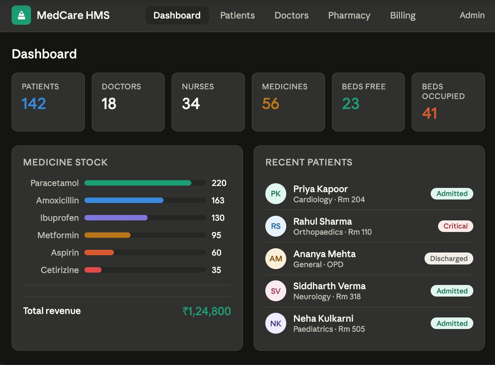
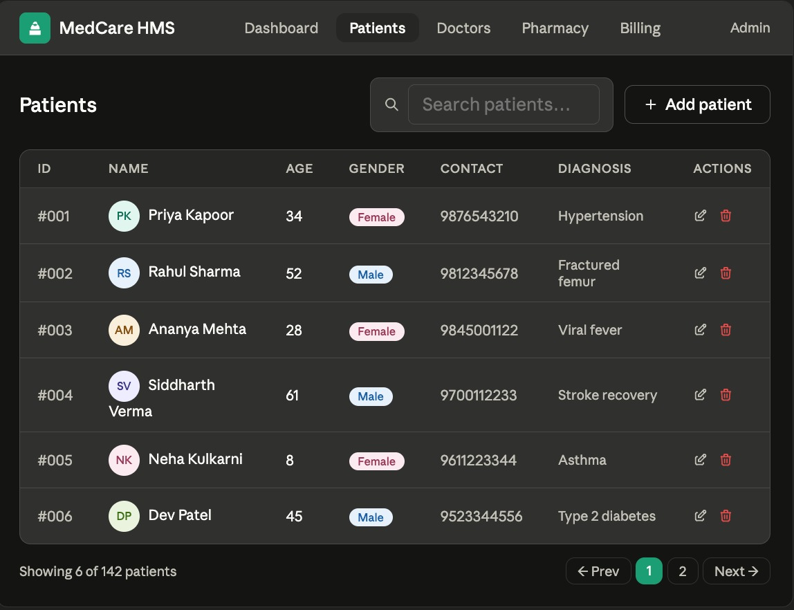
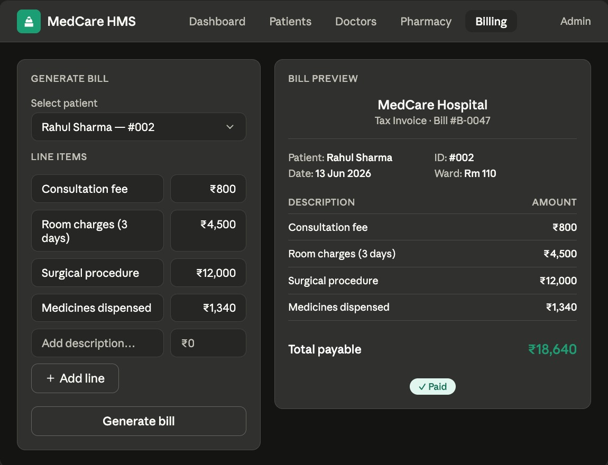

# 🏥 Hospital Management System

**🔗 Live Demo:** [hospital-management-system-mkkr.onrender.com](https://hospital-management-system-mkkr.onrender.com)


The goal was to build a real-world CRUD application that models domain complexity (relationships between patients, staff, facilities, and transactions) while staying deployment-ready.

---

## ✨ Features

| Module | What it does |
|---|---|
| 👤 **Patient Management** | Register, view, and delete patient records (name, age, gender, contact, diagnosis) |
| 🩺 **Doctor Management** | Add doctors with specialization; link to nurses |
| 👩‍⚕️ **Nurse Management** | Assign nurses to doctors with shift tracking |
| 🛏️ **Bed / Facility Management** | Add beds, assign to patients, release on discharge |
| 💊 **Pharmacy** | Track medicine stock and price; deduct inventory on purchase and auto-generate bill entries |
| 🍱 **Canteen & Food Ordering** | Menu management; patients place multi-item food orders |
| 💰 **Billing System** | Generate itemized bills per patient; aggregate revenue tracking |
| 📊 **Admin Dashboard** | Live counts for patients, doctors, nurses, beds, and medicines; revenue summary; medicine stock chart |

---

## 🛠️ Tech Stack

| Layer | Technology |
|---|---|
| **Backend** | Python 3, Flask 3.1 |
| **Database** | SQLite (via Python's built-in `sqlite3`) |
| **Frontend** | HTML5, CSS3, Jinja2 templating |
| **Deployment** | Render (with Gunicorn as the WSGI server) |
| **Other** | pandas, JSON for order/bill serialization |

---

## 🗂️ Project Structure

```
hospital-management-system/
│
├── app.py                  # All Flask routes and DB logic (~390 lines)
├── hospital_PROJECT.py     # Standalone CLI/prototype version
├── requirements.txt        # Flask, Gunicorn, pandas
│
├── templates/              # Jinja2 HTML templates
│   ├── index.html
│   ├── dashboard.html
│   ├── patients.html
│   ├── doctors.html
│   ├── nurses.html
│   ├── facilities.html
│   ├── pharmacy.html
│   ├── canteen.html
│   └── billing.html
│
└── static/                 # CSS and static assets
```

---

## ⚙️ Getting Started

### Prerequisites
- Python 3.8+
- pip

### Installation

```bash
# Clone the repository
git clone https://github.com/SargamS/hospital-management-system.git
cd hospital-management-system

# Install dependencies
pip install -r requirements.txt

# Run the app
python app.py
```

Then open [http://localhost:10000](http://localhost:10000) in your browser.

The SQLite database (`hospital.db`) is created automatically on first run — no setup required.

---

### Dashboard — live stats, medicine stock chart & recent patients


### Patient Management — searchable records with add/delete


### Billing — itemized bill form with live receipt preview


---

## 🚀 Deployment

The app is deployed on [Render](https://render.com) using Gunicorn:

```
gunicorn app:app
```

Environment variable `PORT` is respected at startup (`os.environ.get("PORT", 10000)`), making it compatible with any PaaS platform.
